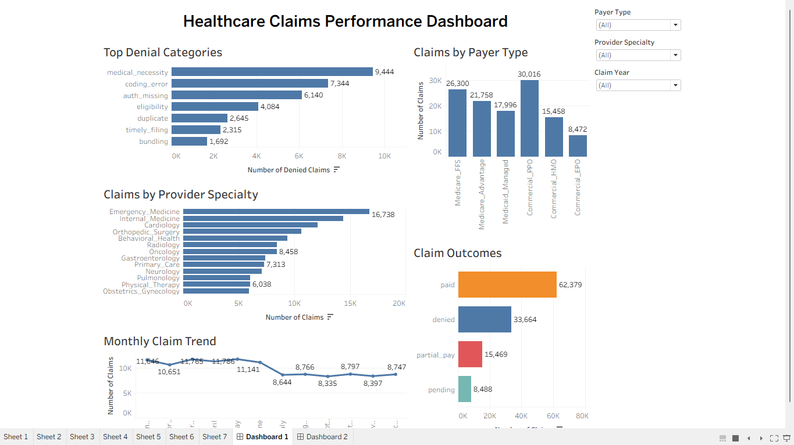
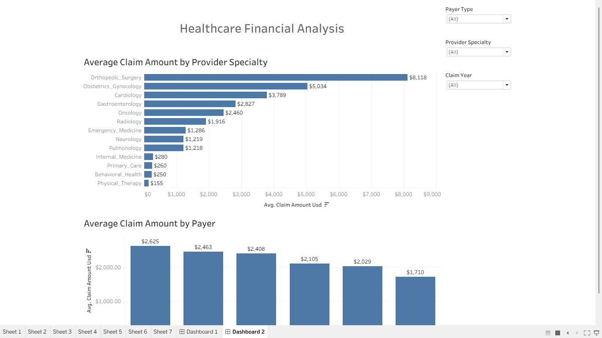

# Healthcare Claim Analysis Dashboard
## Project Overview

This project analyzes healthcare claims data using Tableau to identify trends in payer activity and claim outcomes, denial categories, provider specialty performance, and average claim costs.

This project consists of two interactive dashboards designed for operational and financial decision-making.

---

## Tools Used

-Tableau
-SQL
-Excel

---

## Dashboard

### Operations Dashboard

---

### Financial Dashboard

---

## Business Questions

- Which payer processes the highest number of claims?
- What are the most common denial categories?
- Which provider specialties submit the most claims?
- Which provider specialties have the highest average claim amounts?
- How do claim volumes change over time?

---

## Key Insights

- Commercial PPO processed the highest number of claims.
- Medical necessity was the leading denial category.
- Paid claims represented the majority of claim outcomes.
- Emergency Medicine generated the highest claim volume.
- Orthopedic Surgery had the highest average claim amount.

---

## Skills Demonstrated

- Data Cleaning
- Data Visualization
- Dashboard Design
- SQL Aggregation
- Business Analysis
- Interactive Dashboard Development
- Healthcare Claims Analytics

---

## Repository Structure

...

Healthcare-Claim-Analysis-Dashboard
│
├── dashboard
│   ├── operations-dashboard.png
│   └── financial-dashboard.png
│
├── tableau
│   └── Healthcare Claims Dashboard.twbx
│
├── sql
│
└── README.md

...

---

Author

Alexis Nailing
